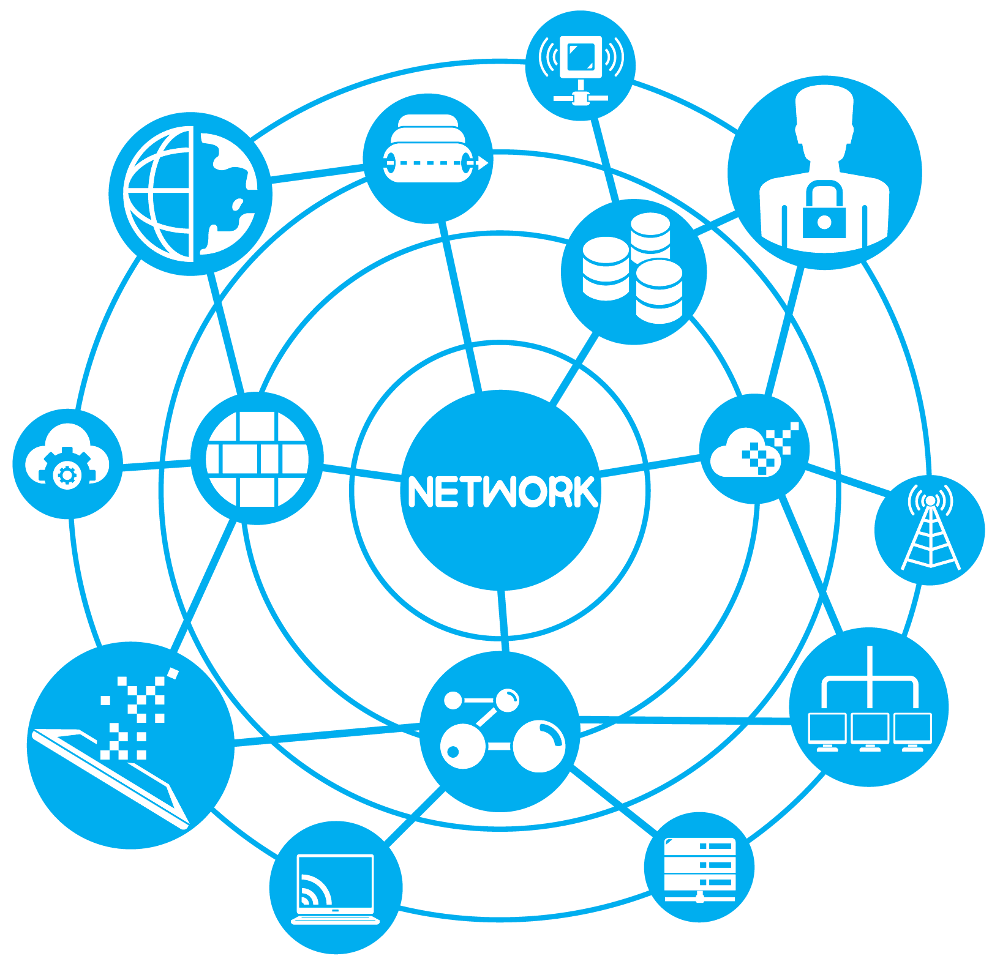

[`Kotlin-Avanzado`](..#readme) > `Sesión 1`

## Sesión 1: Conexiones GET y POST

### 1. Objetivos :dart: 

- Identificar la ruta de comunicación con sistemas remotos mediante sus API REST
- Transformar información contenido en un modelo a una representación JSON
- Analizar el tráfico de datos en la comunicación
- Utilizar el cliente okHttp y retrofit

### 2. Contenido :blue_book:

<ins>Gson e Interceptores</ins>

Crearemos un data class para poder manipular la información en formato JSON recolectada mediante _OkHttp_.

- [**`EJEMPLO 1`**](Ejemplo-01#readme)
- [**`RETO 1`**](Reto-01#readme)

---

<ins>Introducción a Retrofit</ins>

Ahora utilizaremos el cliente Retrofit diseñado para aplicaciones android, resaltando la ventaja de su uso frente a sus alternativas.

- [**`EJEMPLO 2`**](Ejemplo-02#readme)
- [**`RETO 2`**](Reto-02#readme)

---

 <ins>Retrofit y coroutines</ins>

Combinaremos Retrofit con corrutinas para usar http methods.

- [**`EJEMPLO 3`**](Ejemplo-03#readme)

---

### 3. Proyecto :hammer:

Aplica los lineamientos que vienen en esta guía para definir y comenzar el desarrollo de tu proyecto.

- [**`PROYECTO SESIÓN 2`**](Proyecto#readme)

[`Anterior`](..#readme) | [`Siguiente`](../Sesion-03#readme)      

