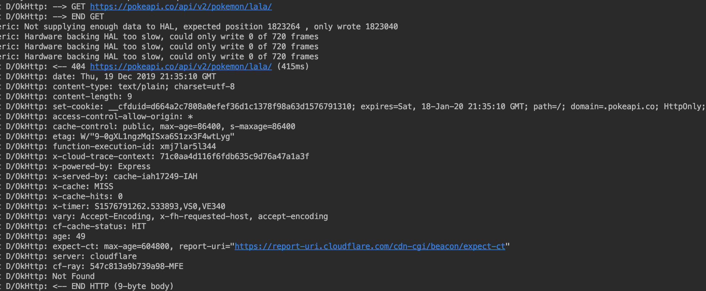
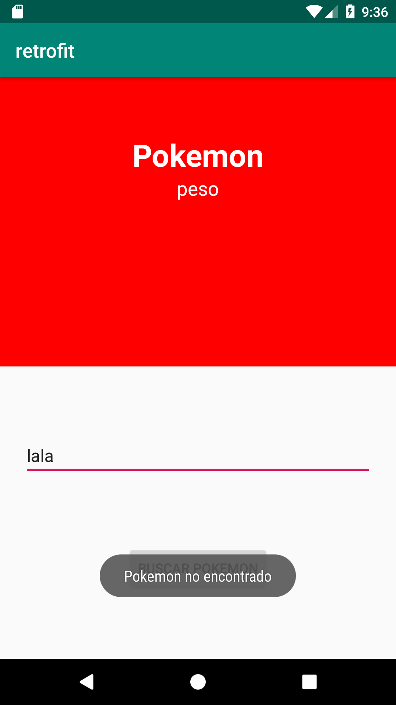

[`Android Avanzado`](../../Readme.md) > [`Sesión 02`](..#readme) > `Reto 2 `

## Reto 2: Retrofit

<div style="text-align: justify;">
### Diccionario :book:

**HTTP Logging**: En Android,  usualmente se refiere a la funcionalidad proporcionada por bibliotecas como OkHttp, que permite registrar (log) las solicitudes y respuestas HTTP para facilitar la depuración y el análisis. Esto incluye información detallada como las cabeceras, el cuerpo del mensaje, los métodos HTTP utilizados, y los tiempos de las transacciones.

### 1. Objetivos :dart:

- Implementar HttpLogging para imprimir los detalles en nuestra llamada HTTP.
- Crear una notificación para alertar al usuario sobre un error.

### 2. Requisitos :clipboard:

1. Haber concluido el [Ejemplos 01](../Ejemplo-01#readme) y [02](../Ejemplo-02#readme), así como el [Reto 01](../Reto-01#readme).

### 3. Desarrollo :computer:

Para terminar con nuestro pokedex, debemos ser capaces de notificar al usuario cuando un pokemon no existe, y de rastrear detalles del tráfico.

  1. Instalar la siguiente dependencia

 ```groovy
 implementation 'com.squareup.okhttp3:logging-interceptor:4.9.0'
 ```

 2.- Vamos a agregar el cliente okHttp a nuestro build de retrofit, para eso hay que definir antes el cliente por medio de esta líneas de código:

 ```groovy
 val client = OkHttpClient.Builder()
                .addInterceptor(interceptor)
                .connectTimeout(TIMEOUT_CALL_SECONDS, TimeUnit.SECONDS)
                .readTimeout(TIMEOUT_CALL_SECONDS, TimeUnit.SECONDS)
                .writeTimeout(TIMEOUT_CALL_SECONDS, TimeUnit.SECONDS)
                .build()
 ```

 El reto es donde suscribir al cliente para que tome efecto (**Hint:** es algo que ya se vio).

 El resultado es la impresión en el logcat que sucede cuando se hace una llamada con retrofit:

 

 3.- Agregar un mensaje (puede ser un Toast) que le notifique al usuario cuando el pokemon que ingresó es inexistente o hay un problema de comunicación. (**Hint:** es en los callbacks de retrofit).

 El mensaje se debe ver parecido a esto: 

  


[`Anterior`](../Ejemplo-02#readme) | [`Siguiente`](../Ejemplo-03#readme)      

</div>

