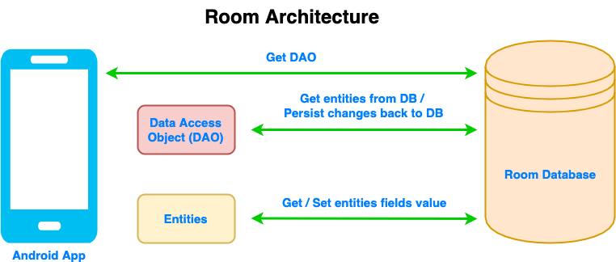
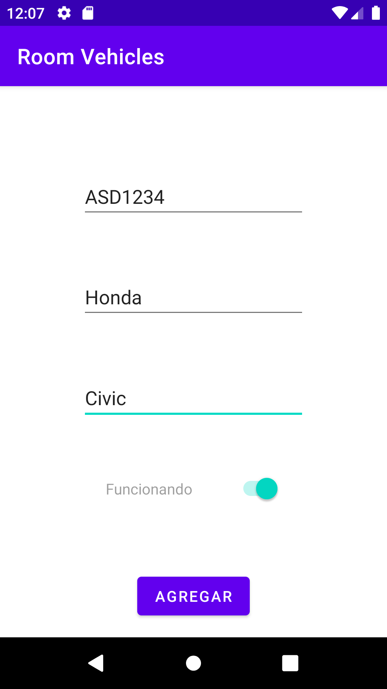
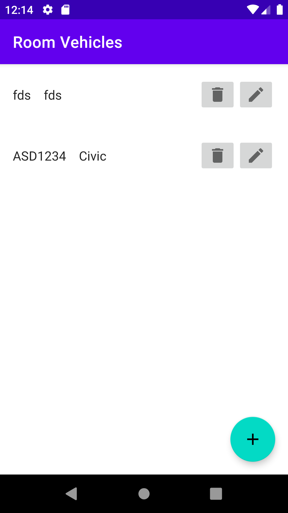

[`Kotlin Avanzado`](../../Readme.md) > [`Sesión 02`](../#readme) > `Ejemplo 2`

## Ejemplo 2: Room

<div style="text-align: justify;">

### 1. Objetivos :dart:


* Almacenar datos en un formato de base de datos.
* Proveer accesos a los datos a través de clases, reduciendo el uso de queries a llamadas a métodos.
* Hacer uso del motor SQLite a través de una capa de abstracción

### 2. Requisitos :clipboard:

1. (recomendable) Tener conocimiento básico de SQL.

### 3. Introducción :airplane:

Ciertas aplicaciones requieren almacenar una cantidad considerable de datos que requieren una gestión y estructuramiento de datos adecuado. Por definición, la solución es una base de datos.

El Framework de Android permite la implementación de __SQLite__ para su uso en la aplicación, que es un motor de base de datos relacional ligero que se gestiona por medio de lenguaje __SQL__.

Podemos hacer la implementación de SQL de dos formas:

* Mediante el uso directo del paquete ___android.database.sqlite___.
* Utilizando la librería de persistencia ___Room___.

La primera opción implica crear la base de datos desde cero, eso requiere gestionar cada cambio de forma manual al editar la estructura de una tabla o crear una nueva que afecte a otra, implementando toas las queries necesarias (creación de tablas y base de datos, queries de nuestro CRUD, convertir los datos recuperados a objetos), entre otras desventajas como el costo de tiempo que implica aprender a utilizar el motor. 

La segunda opción es usar la librería ___Room___, que nos provee de una capa de abstracción que permite automatizar varios procesos de creación de nuestro sistema. Algunas de las ventajas de utilizar esta librería son:

* Obtener datos
* Evitar el código repetitivo a través de clases y anotaciones
* Manipular la información en la base de datos a traves de objetos, siendo este una ORM (Object Relational Mapping)
* Hace una verificación de las queries implementadas en _compile time_ (tiempo de compilación)

Debido a las ventajas que provee la segunda opción, haremos uso de ___Room___.


La siguiente imagen muestra la arquitectura de Room:




Room consta principalmente de los siguientes componentes:

* ___Database___: Clase que se encarga y contiene la base de dato  
* ___Entities___: Clases modelo que representan tablas. Normalmente son implementaciones cortas. 
* ___DAOs___: (Data Access Objects). Nos proveen de métodos para acceder a la base de datos.


### 4. Desarrollo :computer:

A continuación veremos la implementación de cómo usar estos elementos.

Crearemos un proyecto en blanco, y crearemos un nuevo _package_ llamado ___room___ para almacenar las clases relacionadas a la base de datos.

#### Clonando el proyecto

Utilizaremos un [directorio base](base) del proyecto para evitar desarrollar ciertos módulos. 

#### Librería de Gradle

Para poder hacer uso de Room, requeriremos escencialmente dos dependencias en ___build.gradle___:

```kotlin
def room_version = "2.5.1"

implementation "androidx.room:room-runtime:$room_version"
implementation "androidx.room:room-ktx:$room_version"
kapt "androidx.room:room-compiler:$room_version"
```

en el mismo archivo, activamos el plugin __kapt__ (kotlin annotation processor). Que nos servirá adelante para procesar anotaciones que haremos en nuestra definición de tablas.

```kotlin
plugins {
	  ...
    id 'kotlin-kapt'
}
```

#### Definiendo un Entity (Una tabla)

Crearemos una tabla para nuestra app, se llamará ___Vehicle___ y contendrá los siguientes campos:

* ___id___: Identificador numérico de nuestro coche
* ___brand___: Marca del coche
* ___model___: Modelo del coche
* ___platesNumber___: Número de placas
* ___isWorking___: Si el vehículo está habilitado

Con esto, crearemos un data class con estos datos. Para diferenciarlo de una clase simple, utilizaremos distintos _annotations_.

```kotlin
@Entity
data class Vehicle(
    @PrimaryKey(autoGenerate = true) val id: Int = 0,
    @ColumnInfo val model: String?,
    @ColumnInfo val brand: String?,
    @ColumnInfo(name = "plates_number") val platesNumber: String?,
    @ColumnInfo(name="is_working") val isWorking: Boolean
)
```

La anotación ___@Entity___ se coloca una línea anterior al data class definido. ___@PrimaryKey___ enuncia la llave primaria de nuestra tabla, y para nuestro caso utilizaremos un número que se incrementará automáticamente, por tanto usaremos ___autoGenerate=true___ (la asignación también puede ser manual). ___@ColumnInfo___ denota un campo en nuestra tabla, y podemos observar que tiene como parámetro opcional ___name="plates_number"___, lo que implica que en la tabla, el campo lleve el nombre dado en vez del de la variable.


#### Creando nuestro Data Access Object (DAO)

 Un ___DAO___ es una interfaz que define métodos representando ___queries___ a nuestra base de datos.

Definiremos algunos métodos para nuestro CRUD.

```kotlin
@Dao
interface VehicleDao {

    @Insert
    fun insertVehicle(vehicle: Vehicle)

    @Update
    fun updateVehicle(vehicle: Vehicle)

    @Delete
    fun removeVehicle(vehicle: Vehicle)

    @Query("DELETE FROM Vehicle WHERE id=:id")
		fun removeVehicleById(id: Int)

    @Delete
    fun removeVehicles(vararg vehicles: Vehicle)

    @Query("SELECT * FROM Vehicle")
    fun getVehicles(): List<Vehicle>

    @Query("SELECT * FROM Vehicle WHERE id = :id")
    fun getVehicleById(id: Int): Vehicle
}
```

Los métodos enlistados anteriormente reciben algún parámetro de entrada requerido para hacer algun movimiento en la tabla. Las anotaciones en la cabecera de la funciones enlistan el tipo de acción que se está ejecutando.

* ___@Delete___ nos permite eliminar un elemento pasando el objeto que lo representa.
* ___@Insert___ crea en la tabla el nuevo elemento que pasemos como parámetro.
* ___@Update___ permite actualizar un elemento de la tabla, siendo nuestro _Primary Key_ el valor para identificarlo.
* ___@Query___ admite una query personalizada a nuestra base de datos. los parámetros de entrada en la función se usan en el query precedida por dos puntos (__:__) . Los queries con algún error, serán identificados en tiempo de compilación.


#### Setup de la base de datos

Requerimos una representación de la base de datos para obtener acceso a ella y a la información que nos proveen los DAO's.  

Crearemos una clase abstracta que herede de ___RoomDatabase___.

```kotlin
@Database(entities = [Vehicle::class], version = 1)
abstract class VehicleDb : RoomDatabase(){
  
    abstract fun vehicleDao(): VehicleDao

}
```

La clase anterior contiene un método que nos provee acceso a nuestro _DAO_, que nos dará acceso a los datos.


La anotación ___@Database___ se coloca una línea antes de nuestra clase y  puede incluir los siguientes campos en su constructor:

```
Propiedad | Descripción | Parámetro
------ | ------ | --------
entities   | lista de entidades en la base de datos | Array<KClass<*>>
exportSchema | Bandera que decide si crear un historial del esquema de la base de datos en una carpeta | Boolean 
version | número de versión de la base de datos | Int
views | Lista de views en la base de datos | Array<KClass<*>>
```

En nuestro caso, declaramos únicamente como entidad a ___Vehicle___ y definimos como versión 1.

Dentro de nuestra clase, crearemos un método estático implementando el patrón __Singleton__, para asegurarnos de tener una sola instancia de nuestra base de datos.


```kotlin
companion object {
        @Volatile
        private var dbInstance: VehicleDb? = null

        private const val DB_NAME = "vehicle_db"

        fun getInstance(context: Context) : VehicleDb {

            return dbInstance?: synchronized(this) {
                val instance = Room.databaseBuilder(
                    context.applicationContext,
                    VehicleDb::class.java,
                    DB_NAME
                ).build()
                dbInstance = instance

                instance
            }
        }
    }
```

Para crear una solo instancia, podemos hacerlo desde ___BeduApplication___. Esto garantizará que la instancia viva por todo el ciclo de vida de la aplicación.

```kotlin
class BeduApplication: Application() {
    private val database by lazy {VehicleDb.getInstance(this)}
    val vehicleDao
        get() = database.vehicleDao()
}
```

Y con esto, podemos setear una variable ___vehicleDao___ en cada uno de nuestros fragments:

```kotlin
private val vehicleDao by lazy {
    (requireActivity().application as BeduApplication).vehicleDao }
```

#### Enlistando nuestros vehículos

Ahora utilizaremos nuestros elementos en una lista de vehículos. Para eso abriremos ___VehicleListFragment___ y en el método __populateList()__, crearemos un executor,que gestionará una tarea que corre en un hilo, estopara evitar que las queries a las bases de datos bloqueen el ___Main Thread___. ___NOTA:___ Evitaremos el uso de ___AsyncTask___ debido a que está obsoleto desde la API 30 (Android 11). 

```kotlin
 val executor: ExecutorService = Executors.newSingleThreadExecutor()

        executor.execute {

            val vehicleArray = vehicleDao.getVehicles() as MutableList<Vehicle>

            Handler(Looper.getMainLooper()).post {
                adapter = VehicleAdapter(vehicleArray, getListener())
                recyclerVehicle.adapter = adapter
            }
        }
```


Dentro del método execute de nuestro executor encontramos una instancia de nuestra base de datos mediante ___getInstance___, obtenemos nuestro ___DAO___ y utilizamos uno de sus métodos: ___getVehicles___, para obtener la lista de vehículos disponible. dentro del método ___post()___ de nuestro ___Handler___ hacemos procesos dentro del ___UI Thread___, que en este caso es crear y asignar el adapter para la lista con los vehículos como parámetro.


#### Agregando un nuevo vehículo

Ahora abriremos ___AddEditFragment___, y dentro del método ___addVehicle___  pondremos el código que nos permitirá agregar un nuevo elemento a nuestra tabla. Colocaremos un click listener para nuestro botón ___Agregar___ y ahí colocaremos el código. En esta ocasión no evaluaremos nada. El layout es el siguiente:



La implementación comienza por crear un nuevo objeto vehículo con los datos de los campos.

```kotlin
private fun addVehicle() {
        val vehicle = Vehicle(
            brand = binding.editBrand.text.toString(),
            platesNumber = binding.editPlates.text.toString(),
            model = binding.editModel.text.toString(),
            isWorking = binding.switchWorking.isEnabled
        )

        ...
    }
```


Este objeto debe ser la entrada de nuestro método ___insertVehicle___ definido en nuestro ___DAO__, por lo que crearemos un hilo con esta petición:

```kotlin
val executor: ExecutorService = Executors.newSingleThreadExecutor()

executor.execute {
  BeduDb
  .getInstance(context = requireContext())
  ?.vehicleDao()
  ?.insertVehicle(vehicle)

  Handler(Looper.getMainLooper()).post {
    findNavController().navigate(
      R.id.action_addEditFragment_to_vehicleListFragment
    )
  }
}
```

Nótese que la acción a ejecutar posterior a la tarea del hilo es redirigirse a la lista de vehículos (aquí hay un pequeño truco, debido que la navegación remueve el _Fragment_ de lista previo y reemplaza por uno nuevo, permitiendo tener una lista actualizada).

Recreamos el flujo y comprobamos que nuestro nuevo elemento se encuentre en la lista. Cerramos la aplicación y la información debería persistir.




[`Anterior`](../Reto-01#readme) | [`Siguiente`](../Ejemplo-03#readme)      

</div>


