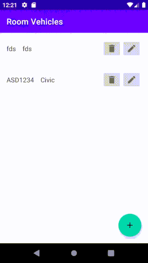
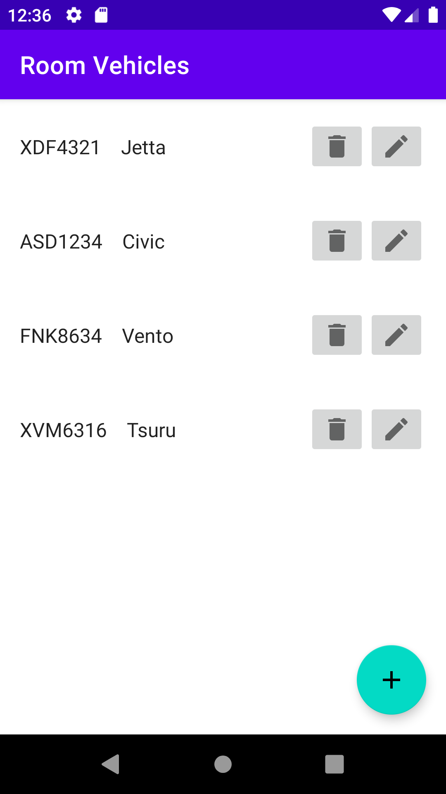
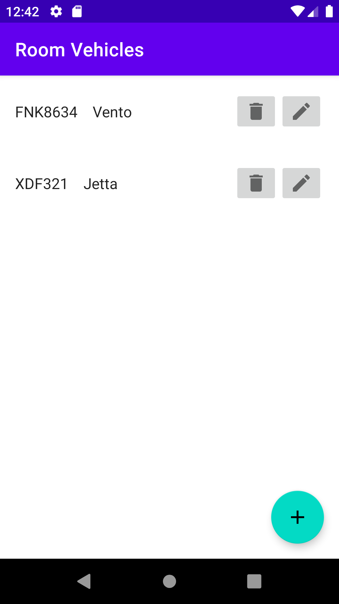

#### [`Kotlin Avanzado`](../../Readme.md) > [`Sesión 02`](../#readme) > `Ejemplo 2`

## Ejemplo 3: Room y coroutines

<div style="text-align: justify;">

### 1. Objetivos :dart:


* Hacer uso de coroutines en Room

### 2. Requisitos :clipboard:
   * Conocimientos básicos de coroutines.

### 3. Desarrollo :computer:

Previamente vimos la implementación con un executor, sin embargo, Room es tan flexible que podemos usarlo con distintos frameworks de programación asíncrona. Para utilizar un coroutine, hace falta únicamente un par de ajustes al código que teníamos previamente.

Primero, agrega el prefijo suspend a cada método del Dao que creamos.

```kotlin
@Dao
interface VehicleDao {

    @Insert
    suspend fun insertVehicle(vehicle: Vehicle)
    
    @Update
    suspend fun updateVehicle(vehicle: Vehicle)
  ...
}
```

Ahora, reemplazaremos el código del método ___populateList()___ por el siguiente:

```kotlin
lifecycleScope.launch {
    val vehicleArray = withContext(Dispatchers.IO) {
       return@withContext vehicleDao.getReducedVehicles() as MutableList<ReducedVehicle>
    }
    adapter = VehicleAdapter(vehicleArray, this@VehicleListFragment)
    binding.list.adapter = adapter
}
```

De igual forma, reemplazamos el anterior código de nuestro método ___addVehicle___ por el siguiente:

```kotlin
val vehicle = Vehicle(
    brand = binding.editBrand.text.toString(),
    platesNumber = binding.editPlates.text.toString(),
    model = binding.editModel.text.toString(),
    isWorking = binding.switchWorking.isEnabled
)

lifecycleScope.launch {
    withContext(Dispatchers.IO) {
        vehicleDao.insertVehicle(vehicle)
    }
    findNavController().navigate(
        R.id.action_addEditFragment_to_vehicleListFragment
    )
}
```

Comprobarás al correr la aplicación que el código sigue funcionando sin ningún problema!

#### Eliminando un elemento de la lista

Ahora eliminaremos un elemento, para esto ya hay dos métodos en nuestro ___VehicleListFragment___ provenientes de una interfaz, uno de ellos es ___onDelete()___ y recibe como parámetro un vehículo, que en este caso será el elemento a eliminar:

```kotlin
  lifecycleScope.launch {
            withContext(Dispatchers.IO) {
                vehicleDao.removeVehicleById(vehicle.id)
            }

            adapter.removeItem(vehicle)
            Toast.makeText(context, "Elemento eliminado!", Toast.LENGTH_SHORT).show()
        }
```

Al eliminar un objeto, veremos el siguiente comportamiento:




#### Filtrando elementos

Agregaremos al menos 4 vehículos a nuestra lista, dos deben coincidir en la marca del coche. 



Crearemos un nuevo método en el DAO que nos de una lista filtrada de vehículos que tengan una misma marca.

```kotlin
    @Query("SELECT * FROM Vehicle WHERE plates_number = :platesNumber")
    suspend fun getVehicleByPlates(platesNumber: String) : Vehicle
```


Ahora vamos a reemplazar el método ___getVehicles()___ por ___getVehiclesByBrand()___ en el _onCreateView_ de ___VehicleListFragment___.

```kotlin
return@withContext vehicleDao.getReducedVehicles("Volkswagen") as MutableList<ReducedVehicle>
```

Y observamos el resultado.



Podemos jugar también con los siguientes dos métodos:

* ___getVehicleById(id)___: Nos regresará un único vehículo debido a que el id es único, por lo que el valor obtenido hay qué meterlo a un List. (imprime primero todos tus vehículos y extrae el id del que quieras filtrar).
* getVehicleByPlates(plates): Filtrará por placas. 

#### Valores únicos para las placas

Hasta ahora, podemos agregar placas del mismo valor; creamos dos vehículos con placas iguales para probarlo y luego eliminamos uno para que no quede guardado. Después, agregaremos esto en la cabecera de nuestro ___Entity___:

```kotlin
@Entity(indices = {@Index(value = {"first_name", "last_name"},
        unique = true)})
```

Al querer correr, nos va a dar un error debido a que estamos cambiando el esquema de nuestra tabla, esto implica elevar a una nueva versión de la tabla. Tendremos nuestra lista eliminada, por lo que agregaremos nuevamente un par de vehículos con mismas placas. Esta vez, nos saldrá este error.


#### Podemos gestionar este error de forma más inteligente de diferentes formas. Te lo dejamos como reto!

#### Reducir campos en una petición

En nuestra lista, únicamente mostramos el modelo y las placas del cochedatos (el id es necesario), y otros valores como la marca o su disponibilidad no se muestran, por lo que costaría menos proceso reducirlo a estos.

Crearemos una nueva clase que contenga dichos valores:

```kotlin
data class ReducedVehicle(
    val id: Int,
    val model: String?,
    val platesNumber: String?
)
```

 y en nuestro DAO, un método que únicamente recupere estos datos:

```kotlin
@Query("SELECT id,model,plates_number as platesNumber FROM Vehicle")
suspend fun getReducedVehicles(): List<ReducedVehicle>
```

  Ahora reemplazamos el método actual para obtener ahora la versión reducida de vehículos. 

```kotlin
return@withContext vehicleDao.getReducedVehicles() as MutableList<ReducedVehicle>
```

Esto implicará cambios de clases en otras instancias en nuestro ___VehicleListFragment___, ___VehicleAdapter___ e ___ItemListener___. Después de realizarlos, imprimimos la nueva lista en el log y verifiquemos que ahora solo salgan los datos demandados. El flujo debería funcionar de la misma forma.

[`Anterior`](../Ejemplo-02#readme) | [`Siguiente`](../Reto-02#readme)      

</div>