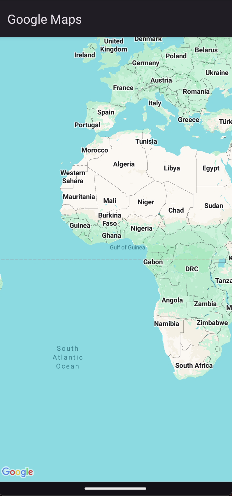
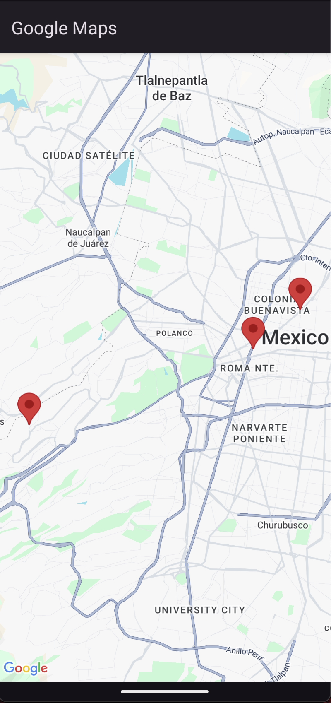
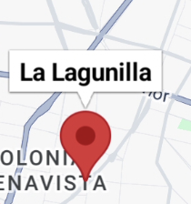
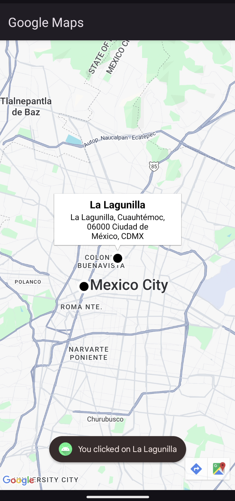

[`Kotlin Avanzado`](../..#readme) > [`Sesión 05`](../Readme.md) > `Ejemplo 2`

## Ejemplo 2: Google Maps

<div style="text-align: justify;">


### 1. Objetivos :dart:

- Implementar el SDK de google maps en una aplicación Android

### 2. Requisitos :clipboard:

- Crear una API Key para el uso de Google Maps Platform usando el SDK de android.
  - [Cómo acceder a Google Cloud Platform y generar una API key](https://developers.google.com/maps/get-started)


### 3. Desarrollo :computer:


1. **Setup Inicial:**

* Instalamos la dependencia para utilizar google maps en android.

```kotlin
implementation ('com.google.android.gms:play-services-maps:19.0.0')
```

No olvides que puedes cambiar la notación por `replace with new library catalog declaration for <library>`

*  Agregamos la API Key de google maps que creamos  en nuestro `local.properties`. 

```kotlin
GOOGLE_MAPS_API_KEY=AQUI_VA_LA_KEY_DE_GOOGLE_MAPS
```

​	Verifica que  `local.properties` esté dentro del `.gitignore`, si no está, agrégala. Esto por motivos de seguridad.

* `Secrets Gradle Plugin` es un complemento de Gradle que facilita la gestión de claves y secretos en aplicaciones Android. Permite definir estos secretos en `local.properties` y acceder a ellos como variables en `BuildConfig` y `AndroidManifest.xml`, eliminando la necesidad de manejar manualmente las propiedades en el código fuente.

  Agregaremos un *classpath* para utilizar `secrets gradle plugin`, dentro del `build.gradle` a nivel proyecto.

```kotlin
buildscript {
    dependencies {
        classpath ("com.google.android.libraries.mapsplatform.secrets-gradle-plugin:secrets-gradle-plugin:2.0.1")
    }
}
```

Ahora implementa este plugin en el `build.gradle`a nivel módulo (app).

```kotlin
id ("com.google.android.libraries.mapsplatform.secrets-gradle-plugin")
```

No olvides activar `viewBinding`!

```kotlin
buildFeatures {
    viewBinding = true
}
```

Después de esto, sincroniza tu app.

* En el `AndroidManifest.xml`, dentro de `<application>` seteamos el Api key que seteamos previamente.

```xml
<meta-data
   android:name="com.google.android.geo.API_KEY"
   android:value="${GOOGLE_MAPS_API_KEY}" />
```

2. **Implementación del mapa en el Activity:**

* Nuestro mapa viene contenido en un `Fragment` llamado `SupportMapFragment`.  Este debe ser contenido en nuestro `MainActivity`, por lo que crearemos un contenedor en su layout `activity_main.xml`.

  ```xml
  <fragment
      class="com.google.android.gms.maps.SupportMapFragment"
      android:id="@+id/map_fragment"
      android:layout_width="match_parent"
      android:layout_height="match_parent" />
  ```

  Corre la app. Tendrás tu primer mapa renderizado!

  

3. **Renderiza Markers**

Para renderizar nuestros markers, es necesario tener una forma de acceder a la latitud y a la longitud de los puntos que vamos a marcar en el mapa. Para este ejemplo, crearemos una clase que contengan estos datos y otros como dirección y nombre de la ubicación. 

* Creamos un data class llamado `Location` que contengan nombre, ubicación y dirección.  

```kotlin
data class Location (
    val name: String,
    val latLng:LatLng,
    val address: String,
)
```

dentro de este archivo, definiremos algunas localizaciones clave de la Ciudad de México :wink: y las almacenaremos en una lista.

```kotlin
private val beduLocation = Location(
    "Bedu",
    LatLng(19.42717,-99.1609062),
    "Londres 61, Juárez, Cuauhtémoc, 06300 Ciudad de México, CDMX"
)

private val guardiaNacionalLocation = Location(
    "Guardia Nacional",
    LatLng(19.3956568,-99.2596921),
    "Sedesol, Álvaro Obregón, 01219 Ciudad de México, CDMX"
)

private val laLagunillaLocation = Location(
    "La Lagunilla",
    LatLng(19.443549,-99.1401553),
    "La Lagunilla, Cuauhtémoc, 06000 Ciudad de México, CDMX"
)

val bestMexicoLocations = listOf(
    beduLocation,
    guardiaNacionalLocation,
    laLagunillaLocation
)
```

* Para agregar estas ubicaciones en nuestro mapa, utilizaremos el objeto `googleMap` que nos provee nuestro `mapFragment` para agregar markers. Crearemos un nuevo método en `MainActivity` donde iteraremos sobre la lista de ubicaciones para renderizarlas una por una.

```kotlin
private fun addLocations(googleMap: GoogleMap) {
    bestMexicoLocations.forEach { place ->
        val marker = googleMap.addMarker(
            MarkerOptions()
                .title(place.name)
                .position(place.latLng)
        )
    }
}
```

Dicho método será llamado en el momento en que mapFragment haya sido inicializado y pueda proveer nuestro objeto `googleMap`.

```kotlin
override fun onCreate(savedInstanceState: Bundle?) {
  ...
  mapFragment?.getMapAsync { googleMap ->
    addLocations(googleMap)
  }
}
```

Si corremos la aplicación, veremos que la cámara del mapa, al igual que anteriormente, sigue mostrándose sobre África. Para lograr que esta se mueva hacia nuestros puntos de interés y los incluya dentro de sus límites, crearemos un nuevo método que itere nuevamente sobre estos puntos para obtener unas coordenadas finales y después mover la cámara hacia allí.

```kotlin
private fun centerCamera(googleMap: GoogleMap) {
    googleMap.setOnMapLoadedCallback {
        val bounds = LatLngBounds.builder()
        bestMexicoLocations.forEach { place -> bounds.include(place.latLng) }
        googleMap.moveCamera(CameraUpdateFactory.newLatLngBounds(bounds.build(), 100))
    }
}
```

Este método será llamado dentro del `getMapAsync`.

```kotlin
mapFragment?.getMapAsync { googleMap ->
    addLocations(googleMap)
    centerCamera(googleMap)
}
```

Tendremos este resultado:



4. **Personalización del marker:**

Los markers que se renderizan por defecto son unos pines rojos. Al tocar cualquiera de ellos, muestran automáticamente el nombre de nuestra ubicación, que fue asignado por la opción `title`.



Para cambiarlo, agregamos un nuevo recurso drawable llamado `custom_marker`:

```xml
<?xml version="1.0" encoding="utf-8"?>
<shape xmlns:android="http://schemas.android.com/apk/res/android"
    android:shape="rectangle">
    <solid android:color="@color/black"/>

    <stroke
        android:width="4dp"
        android:color="@color/white"/>
</shape>
```

Usamos `extract dimension resource` para guardar nuestro width en un archivo `dimens.xml` en vez de hardcodearlo. Dentro de este nuevo recurso, guardaremos también este valor que le dará el tamaño a nuestro Marker.

```xml
<dimen name="location_marker_size">24dp</dimen>
```

Ahora regresamos a `MainActivity`, donde crearemos nuestro ícono `customMarker`. El problema con google maps es que no podemos recuperar directamente el ícono mediante su id, sino que toca convertirlo a tipo `BitmapDescriptor`. 

```kotlin
private val customMarker: BitmapDescriptor by lazy {
    val px = resources.getDimensionPixelSize(R.dimen.location_marker_size)
    val bitmap = Bitmap.createBitmap(px, px, Bitmap.Config.ARGB_8888)
    val canvas = Canvas(bitmap)
    val shape = ContextCompat.getDrawable(this, R.drawable.custom_marker)
    shape?.setBounds(0, 0, bitmap.width, bitmap.height)
    shape?.draw(canvas)
    BitmapDescriptorFactory.fromBitmap(bitmap)
}
```

con esto, en nuestro método `addLocations`, podemos agregar este ícono en el las opciones del marker.

```kotlin
MarkerOptions()
    .title(place.name)
    .position(place.latLng)
    .icon(customMarker)
```

5. **Personalización del window:**

   Creamos un layout personalizado.

```xml
<LinearLayout xmlns:android="http://schemas.android.com/apk/res/android"
    xmlns:tools="http://schemas.android.com/tools"
    android:orientation="vertical"
    android:layout_width="wrap_content"
    android:layout_height="wrap_content"
    android:gravity="center_horizontal"
    android:padding="4dp">

    <TextView
        android:id="@+id/text_view_title"
        android:layout_width="wrap_content"
        android:layout_height="wrap_content"
        android:textColor="@android:color/black"
        android:textSize="18sp"
        android:textStyle="bold"
        tools:text="Casa de los Simpson"/>

    <TextView
        android:id="@+id/text_view_address"
        android:maxWidth="200dp"
        android:layout_width="wrap_content"
        android:layout_height="wrap_content"
        android:textColor="@android:color/black"
        android:textSize="14sp"
        android:maxLines="3"
        android:textAlignment="center"
        android:breakStrategy="balanced"
        tools:text="Avenida siempreviva 123"/>
</LinearLayout>
```

Creamos un adapter para setear los valores de nuestro `location`en nuestra UI.

```kotlin
class MarkerInfoWindowAdapter(private val context: Context): GoogleMap.InfoWindowAdapter {
    override fun getInfoContents(marker: Marker): View {
        val location = marker.tag as Location

        val binding = LocationContentBinding.inflate(LayoutInflater.from(context))

        binding.apply {
            textViewTitle.text = location.name
            textViewAddress.text = location.address
        }

        return binding.root
    }

    override fun getInfoWindow(p0: Marker) = null
}
```

Pasamos ese adapter a `googleMap`.

```kotlin
mapFragment?.getMapAsync { googleMap ->
    ...
    googleMap.setInfoWindowAdapter(MarkerInfoWindowAdapter(this))
    googleMap.setOnInfoWindowClickListener { marker ->
      val location = marker.tag as Location
      val message = "You clicked on ${location.name}"
      Toast.makeText(this, message, Toast.LENGTH_SHORT).show()
    }
}
```

Y finalmente seteamos el valor de location al atributo tag de cada marker en addLocations.

```kotlin
private fun addLocations(googleMap: GoogleMap) {
    bestMexicoLocations.forEach { location ->
        ...
        marker?.tag = location
    }
}
```



[`Anterior`](../Ejemplo-01#readme) | [`Siguiente`](..#readme)      

</div>

